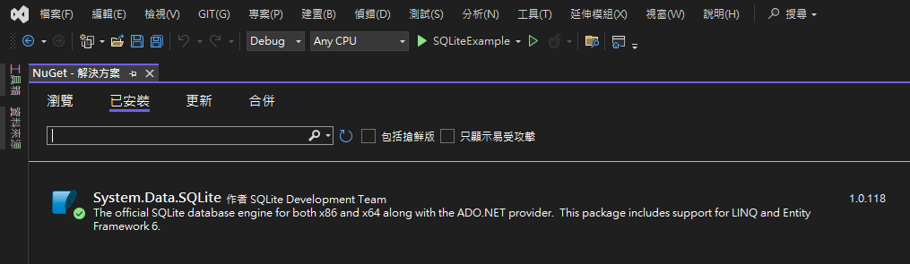
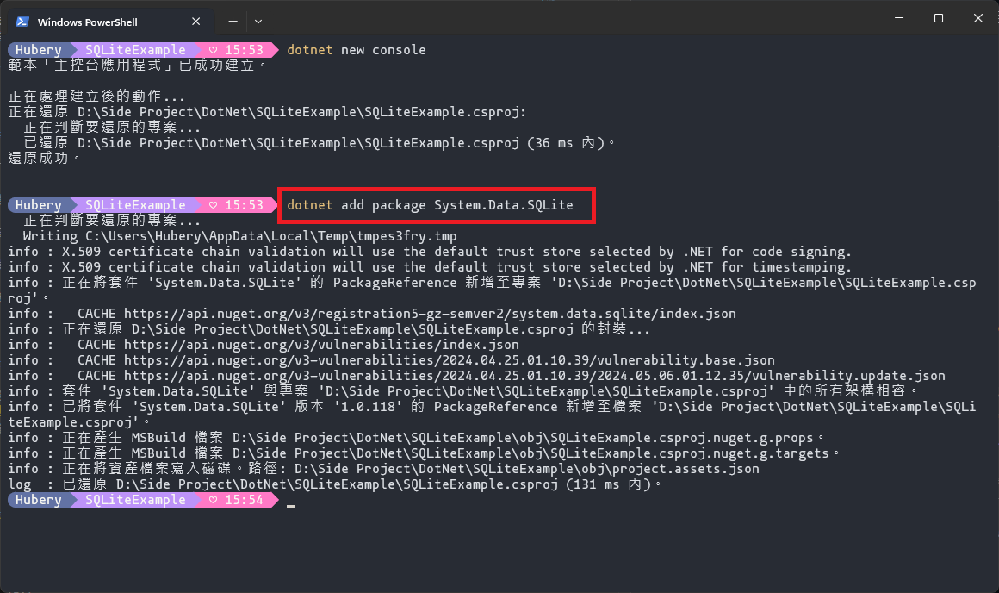
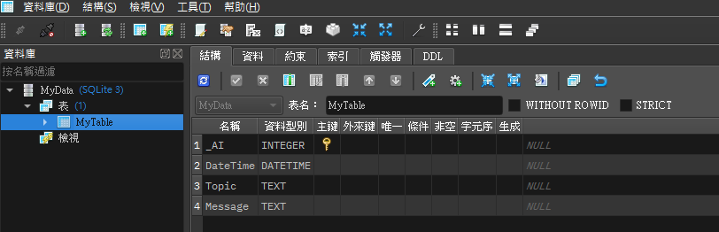

# SQL簡介

SQL是結構化查詢語言Structured Query Language的縮寫

[維基百科](https://zh.wikipedia.org/zh-tw/SQL)

這篇只針對SQLite喔

每次要用SQLite語法時都還要查老半天，應該是下次要用SQLite時已經不知道過了幾百年了，所以把常用的語法整理到這頁要找比較方便

[SQLite官網](https://www.sqlite.org/index.html)

# .NET環境安裝SQLite套件

## Visual Studio

打開NuGet套件管理視窗

搜尋：SQLite

安裝「System.Data.SQLite」

其他還有像是System.Data.SQLite.Core、System.Data.SQLite.Linq的東西可以安裝

我目前還沒用到，所以就沒裝了



## .NET指令環境(終端機、VSCode)

終端機進入到專案資料夾中

輸入指令：dotnet add package System.Data.SQLite



# 常用指令

[範例資料庫](./MyData.db)

## SQLite資料型態

- NULL
- INTEGER
- REAL
- TEXT
- BLOB：根據MySQL的語法表示，是儲存二進制文件用的。如：圖片、影片、檔案之類的
- DATETIME：儲存時間的格式（yyyy-MM-DD hh:mm:ss.ms）
- BOOLEAN：SQLite沒這個東西，所以要用整數0(假)或1(真)來儲存。官網有寫從2018-04-02的版本開始已經可以認得"TRUE"跟"FALSE"了 ~~，但不知道可以幹嘛~~

## 建立資料表

```sql
CREATE TABLE ExampleTable (_AI INTEGER PRIMARY KEY AUTOINCREMENT,Topic TEXT,Message TEXT);
```

可以加上IF NOT EXISTS來判斷資料表是否存在，不存在才建立

```sql
CREATE TABLE IF NOT EXISTS ExampleTable (_AI INTEGER PRIMARY KEY AUTOINCREMENT,Topic TEXT,Message TEXT);
```

上述指令會建立一個新的資料表（不存在才建立）

資料表名稱為ExampleTable

表中有3個欄位

- _AI：是一個Integer型態的主鍵，並套用AUTOINCREMENT屬性，表示在插入新資料時此欄位會自動遞增
- Topic：是一個TEXT型態的欄位，可以儲存字串資料
- Message：是一個TEXT型態的欄位，可以儲存字串資料

建立表格執行結果


## 插入資料


## 查詢資料

```sql
SELECT `Topic`,`Message` FROM `MyTable`
```

從MyTable中篩選出Topic及Message欄位的資料

執行結果

