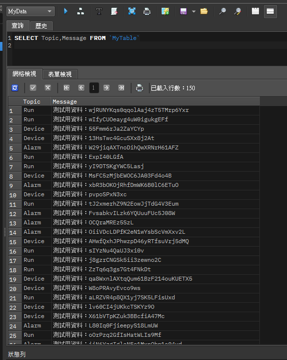
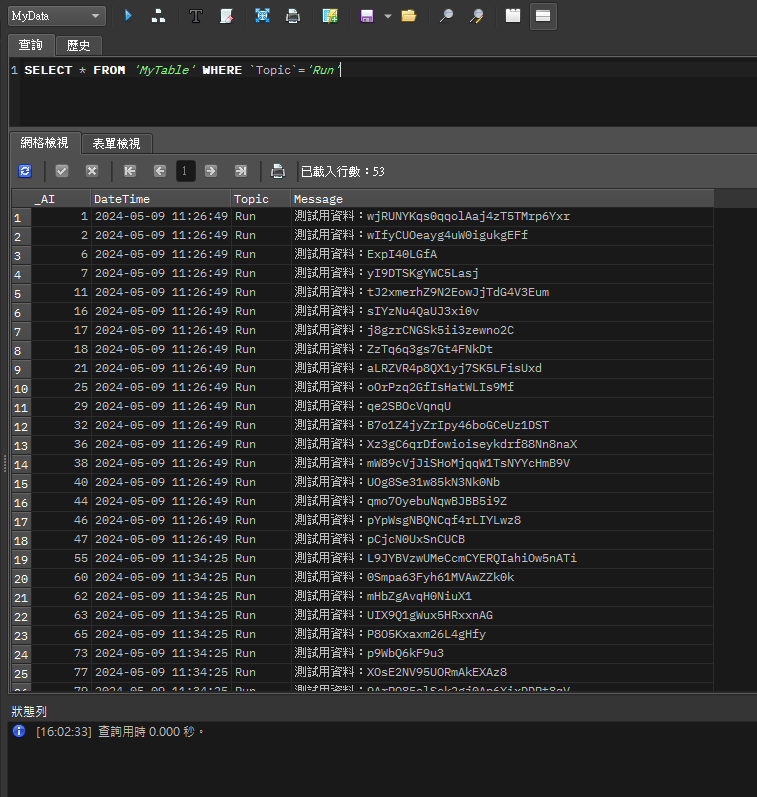

# SQL簡介

SQL是結構化查詢語言Structured Query Language的縮寫

[維基百科](https://zh.wikipedia.org/zh-tw/SQL)

這篇只針對SQLite喔，有些語法可能不適用

每次要用SQLite語法時都還要查老半天，應該是下次要用SQLite時已經不知道過了幾百年了，所以把常用的語法整理到這頁要找比較方便

[SQLite官網](https://www.sqlite.org/index.html)

# .NET環境安裝SQLite套件

## Visual Studio

打開NuGet套件管理視窗

搜尋：SQLite

安裝「System.Data.SQLite」

其他還有像是System.Data.SQLite.Core、System.Data.SQLite.Linq的東西可以安裝

我目前還沒用到，所以就沒裝了


## .NET指令環境(終端機、VSCode)

終端機進入到專案資料夾中

輸入指令：dotnet add package System.Data.SQLite


[Nuget網頁](https://www.nuget.org/packages/System.Data.SQLite)

# 常用指令

SQLite也有資料庫管理軟體喔

SQLiteStudio有提供建立、刪除、修改等基本功能，因此就算不是寫程式也是可以用來儲存資料。另外也有SQL語法編輯器可使用SQL指令執行，就像是個輕便而且不用安裝的MySQL呢

[SQLiteStudio下載](https://sqlitestudio.pl/)

[範例資料庫，點我下載](./MyData.db)

## SQLite資料型態

- NULL
- INTEGER
- REAL
- TEXT
- BLOB：根據MySQL的語法表示，是儲存二進制文件用的。如：圖片、影片、檔案之類的
- DATETIME：儲存時間的格式（yyyy-MM-DD hh:mm:ss.ms）
- BOOLEAN：SQLite沒這個東西，所以要用整數0(假)或1(真)來儲存。官網有寫從2018-04-02的版本開始已經可以認得"TRUE"跟"FALSE"了 ~~，但不知道可以幹嘛~~

## 建立資料表

```sql
CREATE TABLE MyTable (_AI INTEGER PRIMARY KEY AUTOINCREMENT,DateTime DATETIME,Topic TEXT,Message TEXT);
```

可以加上IF NOT EXISTS來判斷資料表是否存在，不存在才建立

```sql
CREATE TABLE IF NOT EXISTS MyTable (_AI INTEGER PRIMARY KEY AUTOINCREMENT,DateTime DATETIME,Topic TEXT,Message TEXT);
```

使用 CREATE TABLE 可以建立一個新的資料表。加上 IF NOT EXISTS 的判斷，可以確保只有在該表不存在時才會執行建立操作，避免重複建立相同名稱的資料表而導致錯誤

在上述SQL指令中：

- 資料表名稱為MyTable
- _AI：是一個Integer型態的主鍵，並套用AUTOINCREMENT屬性，表示在插入新資料時此欄位會自動遞增
- DateTime：是一個DATETIME型態的欄位，可以儲存時間的資料
- Topic：是一個TEXT型態的欄位，可以儲存字串資料
- Message：是一個TEXT型態的欄位，可以儲存字串資料

建立表格的執行結果如下圖所示：


```sql
UPDATE sqlite_sequence SET seq=0 WHERE NAME="MyTable"
```

此指令可設定AUTOINCREMENT的值（正常操作下不建議使用）

## 取得欄位資料

```sql
PRAGMA table_info('MyTable')
```

上述指令可以查詢在MyTable資料表內各欄位的資料

執行結果如下：


## 插入資料

```sql
INSERT OR IGNORE INTO `MyTable` VALUES (NULL,DATETIME('NOW', 'LOCALTIME'),'Topic資料','Message資料')
```

使用INSERT將資料插入到MyTable的資料表中，並指定各個欄位的值。

在上述SQL指令中：

- OR IGNORE：表示如果插入的資料與資料表中已有的資料重複，則忽略這條插入指令，不會導致主鍵重複的錯誤。這在避免插入重複資料時很有用
- VALUES：是指定資料表內各欄位的值
- (NULL, DATETIME('now', 'localtime'), 'Topic資料', 'Message資料')：這是要插入的資料值的清單，按照資料表中欄位的順序進行排列。在這個例子中，它指定了四個欄位的值。第一個值是 NULL，表示主鍵_AI會自動遞增。第二個值是DATETIME('now', 'localtime')，表示目前的日期和時間。接下來的兩個值是字串'Topic資料'和'Message資料'，分別是Topic和Message欄位的值

## 查詢資料

### 列出所有資料

```sql
SELECT * FROM "Mytable"
```

列出MyTable中所有資料

### 列出特定欄位

```sql
SELECT `Topic`,`Message` FROM `MyTable`
```

從MyTable中列出Topic及Message欄位的所有資料

SELECT的執行結果如下圖所示：



### 加入條件搜尋

#### WHERE

```sql
SELECT * FROM 'MyTable' WHERE `Topic`='Run'
```

從MyTable中篩選出Topic欄位是'Run'的所有資料

SELECT-WHERE的執行結果如下圖所示：



#### LIKE

```sql
SELECT * FROM 'MyTable' WHERE `Message` LIKE '%測試%'
```

從MyTable中篩選出Message欄位中的值包含"測試"的項目

在SQL中LIKE是模糊配對的操作，可以搜尋特定格式的資料，上述例子中的%是代表萬用字元，因此可以解讀為資料中包含"測試"的所有資料

題外話
- '%測試'："測試"在句尾
- '測試%'："測試"在句首

SELECT-LIKE的執行結果如下圖所示：

